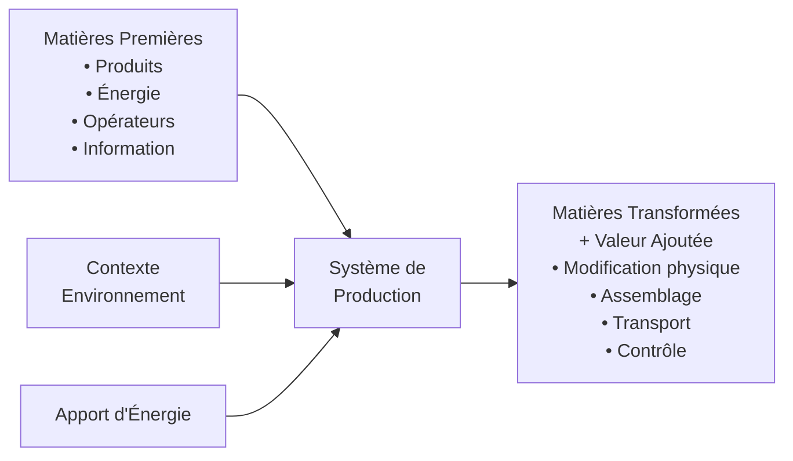
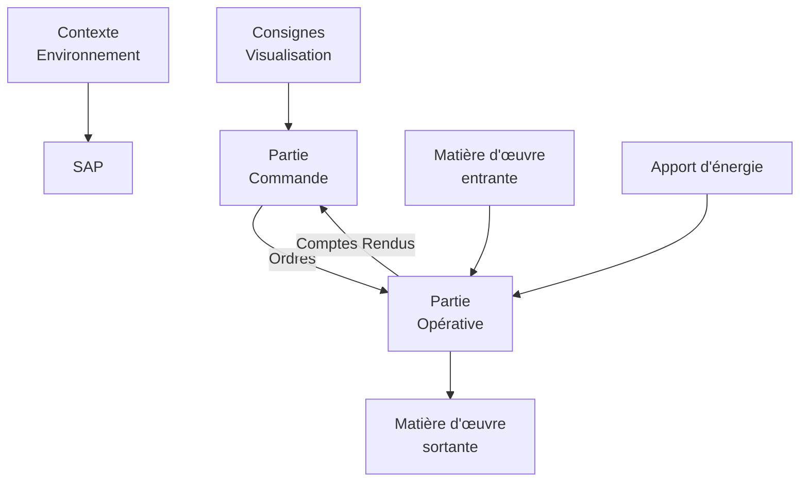
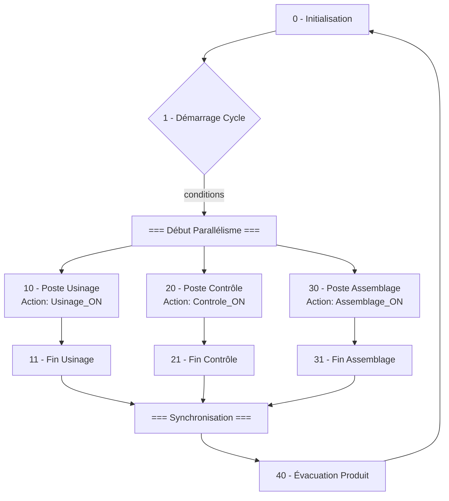
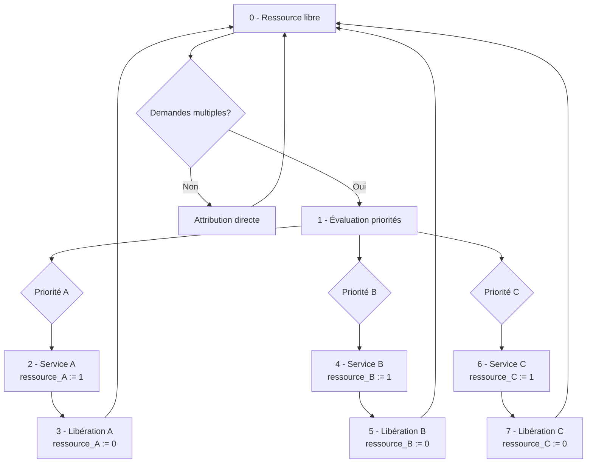
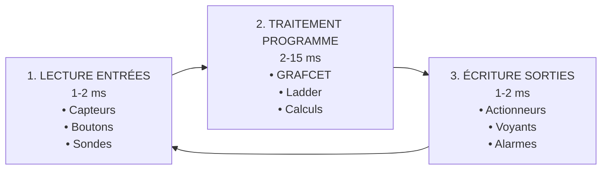
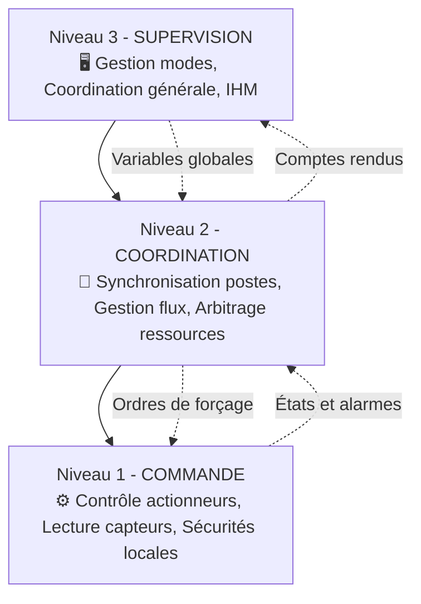
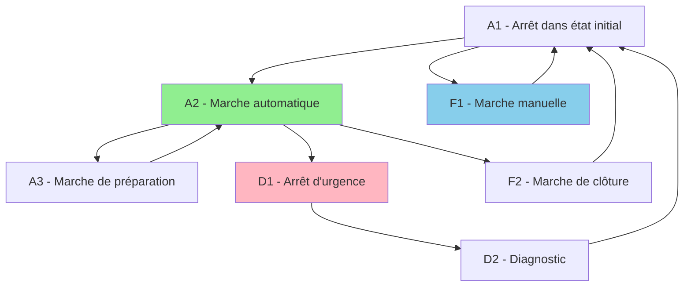
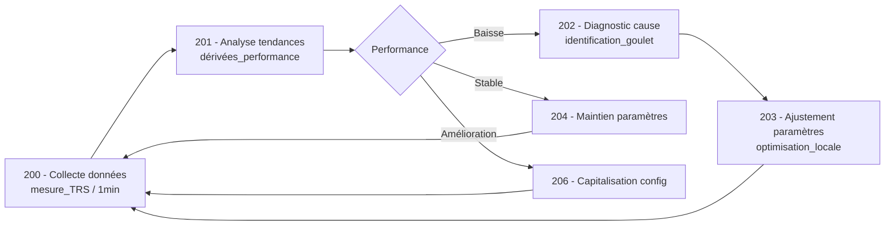

# Logique Industrielle
## Description de la commande séquentielle des SAP

### 🎯 Objectifs du cours
- Comprendre les **Systèmes Automatisés de Production** (SAP)
- Maîtriser l'outil **GRAFCET** pour la modélisation
- Savoir implémenter sur **Automates Programmables** (API)
- Appréhender la gestion des **modes de fonctionnement** (GEMMA)

<div class="pt-12">
  <span @click="$slidev.nav.next" class="px-2 py-1 rounded cursor-pointer" hover="bg-white bg-opacity-10">
    Commencer le cours <carbon:arrow-right class="inline"/>
  </span>
</div>

---
layout: default
---

# Programme du Cours

<div class="grid grid-cols-2 gap-4">

<div>

## 📚 **Contenu Théorique**
- Description des **SAP** (Systèmes Automatisés)
- Outils de **logique combinatoire** 
- Le **GRAFCET** (règles et applications)
- **Automates Programmables** Industriels
- Structuration des **systèmes complexes**
- Guide **GEMMA** (modes de marche/arrêt)

</div>

<div>

## 🛠️ **Applications Pratiques**
- **Station de lavage** automatique
- **Ligne pharmaceutique** avec traçabilité
- **Parking intelligent** (IoT)
- **Poste de conditionnement**
- **Ligne d'assemblage** automobile
- **Systèmes de tri** et manutention

</div>

</div>

<div class="grid grid-cols-3 gap-4 mt-8">
  <div class="text-center">
    <carbon:industry class="text-4xl mx-auto mb-2"/>
    <div class="text-sm">Industrie 4.0</div>
  </div>
  <div class="text-center">
    <carbon:flow class="text-4xl mx-auto mb-2"/>
    <div class="text-sm">GRAFCET</div>
  </div>
  <div class="text-center">
    <carbon:chip class="text-4xl mx-auto mb-2"/>
    <div class="text-sm">Automates</div>
  </div>
</div>

---
layout: two-cols
---

# 🏭 Exemples que vous connaissez déjà

::left::

## Dans votre quotidien
- **Feux de circulation** 🚦
  - Logique séquentielle simple
  - Temporisations programmées
  - Gestion des priorités

- **Ascenseurs** 🏢  
  - Multi-étages avec priorités
  - Sécurités intégrées
  - Optimisation des trajets

- **Distributeurs** automatiques ☕
  - Séquences conditionnelles
  - Gestion stock et monnaie
  - Interface utilisateur

::right::

## Dans l'industrie
- **Chaînes automobile** 🚗
  - Coordination multi-postes
  - Contrôle qualité intégré
  - Traçabilité complète

- **Centres logistiques** 📦
  - Tri automatisé (Amazon, DHL)
  - Optimisation des flux
  - Robotique avancée

- **Usines agro-alimentaires** 🥛
  - Conditionnement haute cadence
  - Normes d'hygiène strictes
  - Maintenance prédictive

---
layout: center
class: text-center
---

# 📊 Pourquoi l'Automatisation ?

<div class="grid grid-cols-2 gap-8 mt-8">

<div>

## 🎯 **Enjeux du 21ème siècle**
- **+15%** productivité moyenne
- **-40%** erreurs humaines  
- **24h/24** fonctionnement possible
- **-30%** coûts de production

</div>

<div>

## 🌍 **Votre futur métier**
- **Industrie 4.0** : Usines connectées
- **Logistique** : Entrepôts intelligents
- **Énergie** : Réseaux automatisés
- **Pharma** : Production sécurisée

</div>

</div>

<div class="mt-12">
  <div class="text-2xl font-bold">L'automatisation = Compétitivité + Sécurité + Qualité</div>
</div>

---
layout: default
---

# 🎮 Quiz d'Évaluation Initiale

<div class="grid grid-cols-1 gap-6">

## **Question 1** : Dans une usine, qu'est-ce qui constitue la "Partie Opérative" ?
<div class="grid grid-cols-2 gap-4 ml-4">
  <div>a) Les ordinateurs de commande</div>
  <div>b) Les machines, convoyeurs, actionneurs ✅</div>
  <div>c) Les opérateurs humains</div>
  <div>d) Les programmes informatiques</div>
</div>

## **Question 2** : Un ascenseur à 3 étages nécessite combien d'états minimum ?
<div class="grid grid-cols-2 gap-4 ml-4">
  <div>a) 3 états</div>
  <div>b) 6 états (montée + descente)</div>
  <div>c) 9 états (positions + mouvements)</div>
  <div>d) Cela dépend du cahier des charges ✅</div>
</div>

</div>

<div class="mt-8 p-4 bg-blue-100 rounded">
💡 <strong>Objectif</strong> : Évaluer vos connaissances initiales pour adapter le rythme du cours
</div>

---
layout: section
---

# Chapitre 1
## Systèmes Automatisés de Production (SAP)

---
layout: two-cols
---

# 🏗️ Définition d'un Système de Production

::left::

## **Définition**
Toute transformation d'un ensemble de **matières premières** ou composants semi-finis en **produits finis**

### 🎯 **Objectifs**
- Répondre aux **besoins client**
- Satisfaire diverses **contraintes** :
  - Délai, coût, compétitivité
  - Service après-vente, évolutivité
  - Présentation, communication

::right::

## **Décomposition en 2 sous-systèmes**

### 🏭 **Système de Fabrication** (Partie Opérative)
- **Ressources principales** : Machines, stocks, opérateurs
- **Moyens de transfert** : Convoyeurs, robots
- **Outils et supports** : Palettes, outillages

### 🧠 **Système de Pilotage** (Partie Commande)
- **Captage** : Récupération d'informations
- **Décision** : Analyse et traitement
- **Action** : Ordres vers la fabrication

---
layout: default
---

# 🔄 Description d'un Système de Production



## 💰 **Calcul de la Valeur Ajoutée**
```
VA = Valeur Sortie - (Valeur Entrée + Coûts Transformation)

Exemple concret :
- 100 kg matière à 5€/kg = 500€
- Produit fini vendu 8€/kg = 800€  
- Coût énergie = 50€
→ VA = 800 - (500 + 50) = 250€
```

---
layout: two-cols
---

# 🤖 Système Automatisé de Production

::left::

## **Architecture Générale**



::right::

## **Composants Essentiels**

### 🏭 **Partie Opérative (PO)**
- Traite les **matières d'œuvre**
- Élabore la **valeur ajoutée**
- Exemples : Machines, robots, convoyeurs

### 🧠 **Partie Commande (PC)**  
- Coordonne les **actions** sur la PO
- Gère les **séquences** d'opérations
- Exemples : Automates, ordinateurs industriels

<div class="mt-6 p-4 bg-green-100 rounded">
✅ <strong>Règle fondamentale</strong> : Tout SAP = PO + PC
</div>

---
layout: default
---

# 🎯 Objectifs de l'Automatisation

<div class="grid grid-cols-2 gap-8">

<div>

## 📈 **Bénéfices Économiques**
- **Productivité** : +15 à 30% en moyenne
- **Rentabilité** : ROI < 3 ans typique
- **Flexibilité** : Adaptation rapide produits
- **Compétitivité** : Réduction coûts unitaires

## 🛡️ **Sécurité et Qualité**  
- **Répétabilité** : Même qualité à chaque cycle
- **Environnements hostiles** : Nucléaire, spatial
- **Tâches pénibles** : Réduction des TMS
- **Sécurité** : -60% accidents industriels

</div>

<div>

## 📊 **Domaines d'Application**

### 🏭 **Niveaux d'Automatisation**
- **Machine** : Poste de travail individuel
- **Atelier** : Ligne de production
- **Usine** : Site de production complet
- **Groupe** : Ensemble d'usines connectées

### 🌐 **Secteurs Concernés**
- Automobile (robotique, assemblage)
- Aéronautique (usinage, composite)  
- Pharmacie (traçabilité, qualité)
- Agro-alimentaire (hygiène, cadence)
- Logistique (tri, stockage automatisé)

</div>

</div>

---
layout: section
---

# Chapitre 2  
## Logique Combinatoire vs Séquentielle

---
layout: two-cols
---

# 🔢 Algèbre de Boole - Rappels

::left::

## **Variables et Opérations**
```
Variable booléenne : a = 0 ou a = 1
- a = 0 : FAUX (capteur inactif)
- a = 1 : VRAI (capteur actif)

Opérations de base :
- Complément : ā (NON a)
- Somme : a + b (a OU b)  
- Produit : a.b (a ET b)
```

## **Propriétés Essentielles**
```
a + 0 = a     a.1 = a
a + 1 = 1     a.0 = 0
a + ā = 1     a.ā = 0
a + a = a     a.a = a
```

::right::

## **Exemple Pratique : Démarrage Voiture**

### Conditions pour démarrer :
- Clé de contact = 1
- Frein appuyé = 1
- Vitesse = 0 (point mort)

### Expression logique :
```
Démarrage = Clé . Frein . Vitessē
```

### 🎮 **À vous de jouer !**
*"Un distributeur de café sert SI il y a de l'eau ET (soit de la monnaie, soit une carte)"*

**Réponse :** `Service = Eau . (Monnaie + Carte)`

---
layout: default
---

# ⚡ Logique Combinatoire vs Séquentielle

<div class="grid grid-cols-2 gap-8">

<div>

## **🔄 Logique Combinatoire**
```
Sortie = f(Entrées actuelles)
```

### Exemple : Feu tricolore simple
```
SI (piéton_demande = 1) 
ALORS rouge_voiture = 1
```

### Caractéristiques :
- **Instantané** : Réaction immédiate
- **Sans mémoire** : Pas d'historique
- **Réversible** : Entrée = 0 → Sortie = 0

</div>

<div>

## **📚 Logique Séquentielle**
```
Sortie = f(Entrées, État précédent, Historique)
```

### Exemple : Feu intelligent
```
État 1 : Vert voiture (30s)
État 2 : Orange voiture (3s)
État 3 : Rouge voiture + Vert piéton (20s)
```

### Caractéristiques :
- **Temporisé** : Évolution dans le temps
- **Avec mémoire** : États précédents
- **Séquentiel** : Ordre des opérations

</div>

</div>

<div class="mt-8 p-4 bg-yellow-100 rounded">
🚨 <strong>Point Clé</strong> : Les systèmes industriels sont majoritairement séquentiels !
</div>

---
layout: default
---

# 🛠️ Outils de Description

<div class="grid grid-cols-3 gap-6">

<div>

## **Logique Combinatoire**
- **Table de vérité** 
- **Équations booléennes**
- **Logigrammes**
- **Schémas à contacts**
- **Chronogrammes**

### Exemple : Portail ET
```
Entrée A ----[>----
            ET   Sortie S
Entrée B ----[>----

S = A . B
```

</div>

<div>

## **Logique Séquentielle** 
- **GRAFCET** ⭐ (notre focus)
- **Réseaux de Petri**
- **Graphes d'états**
- **Diagrammes temporels**
- **GEMMA** (modes de marche)

### Exemple : Séquence
```
État 0 → Condition → État 1 → Action
  ↑                              ↓
État 2 ← Condition ← État 1
```

</div>

<div>

## **Mise en Œuvre**
- **Systèmes câblés** :
  - Relais, contacteurs
  - Séquenceurs pneumatiques
  - Cartes électroniques

- **Systèmes programmés** :
  - **Automates** (API) ⭐
  - Microcontrôleurs
  - Ordinateurs industriels

</div>

</div>

---
layout: section
---

# Chapitre 3
## Les Bases du GRAFCET

---
layout: center
class: text-center
---

# 📈 Le GRAFCET

## **GRAphe Fonctionnel de Commande Étape Transition**

<div class="mt-8">

### 🏆 **Historique**
- **1977** : Invention en France (AFCET)
- **1982** : Norme française NF C03-190  
- **1988** : Norme internationale IEC 848
- **1993** : IEC 1131-3 (langages automates)
- **2002** : IEC 60848 Ed.2 (version actuelle)

</div>

<div class="mt-8 p-6 bg-blue-100 rounded-lg">
  <div class="text-xl font-bold">🎯 Définition</div>
  <div class="mt-2">Outil graphique pour représenter et analyser le fonctionnement d'un système automatisé de manière claire et structurée</div>
</div>

---
layout: default
---

# 🔧 Présentation de l'Outil GRAFCET

<div class="grid grid-cols-3 gap-6">

<div>

## **🟦 ÉTAPES → ACTIONS**

### **Rôle** : Représenter un **ÉTAT** du système
```
┌─────┐
│  n  │  ← Numéro d'étape (unique)
└─────┘
   ↓
 Action  ← Ce qui se passe dans cet état
```

### **Une étape peut être :**
- **Active** : Le système est dans cet état
- **Inactive** : Le système n'est pas dans cet état

### **Principe :**
```
SI étape active → Action exécutée
SI étape inactive → Action non exécutée
```

</div>

<div>

## **⬜ TRANSITIONS → RÉCEPTIVITÉS**

### **Rôle** : Représenter les **CONDITIONS** de passage
```
 ───────  ← Barre horizontale
condition ← Réceptivité (condition logique)
```

### **Une transition peut être :**
- **Validée** : Étapes précédentes actives
- **Franchissable** : Validée ET réceptivité vraie
- **Franchie** : Passage effectué

### **Principe :**
```
SI transition franchie → Changement d'état
```

</div>

<div>

## **🔗 LIAISONS → ARCS ORIENTÉS**

### **Rôle** : Représenter l'**ORDRE** des opérations
```
│  ← Arc orienté (flèche)
│     (sens conventionnel : haut → bas)
▼
```

### **Types de liaisons :**
- **Simple** : Séquence linéaire
- **Divergence** : Choix ou parallélisme
- **Convergence** : Regroupement

### **Principe :**
```
Les flèches indiquent le SENS d'évolution
du GRAFCET
```

</div>

</div>

---
layout: default
---

# 📍 Qu'est-ce qu'une ÉTAPE ?

<div class="grid grid-cols-2 gap-8">

<div>

## **Définition**
Une **étape** correspond à une **SITUATION** dans laquelle le comportement du système est **INVARIANT** vis-à-vis des entrées et des actions.

## **Représentation Graphique**

### **Étape Normale**
```
┌─────┐
│  5  │  ← Numéro unique (entier positif)
└─────┘
```

### **Étape Initiale** (double carré)
```
┌═════┐
│  0  │  ← Active au démarrage du système
└═════┘
```

### **Exemples d'étapes**
- **Étape 0** : Système au repos
- **Étape 1** : Moteur en marche
- **Étape 2** : Attente pièce
- **Étape 3** : Cycle de lavage

</div>

<div>

## **États d'une Étape**

### **Étape ACTIVE** 🟢
```
┌─────┐ ●  ← Marquage (jeton)
│  2  │    Le système EST dans cet état
└─────┘    → L'action est EXÉCUTÉE
  Pompe := 1
```

### **Étape INACTIVE** 🔴
```
┌─────┐
│  2  │    Le système N'EST PAS dans cet état
└─────┘    → L'action n'est PAS exécutée
  Pompe := 1
```

## **⚡ Règle Fondamentale**
<div class="p-4 bg-yellow-100 rounded">
<strong>Une étape peut être soit ACTIVE, soit INACTIVE</strong><br/>
Il n'y a pas d'état intermédiaire !
</div>

## **💡 Exemple Concret**
```
Ascenseur à l'étage 2 :
→ Étape "À l'étage 2" = ACTIVE
→ Étape "À l'étage 1" = INACTIVE
→ Étape "À l'étage 3" = INACTIVE
```

</div>

</div>

---
layout: default
---

# ⚡ Les TRANSITIONS - Types et Structures

<div class="grid grid-cols-2 gap-8">

<div>

## **Transition Simple**
```
┌─────┐
│  1  │
└─────┘
    │
 ───────  ← UNE seule barre
   a.b     ← UNE réceptivité
    │
┌─────┐
│  2  │
└─────┘
```
**Usage** : Passage séquentiel normal

## **Jonction EN ET** (Convergence)
```
┌─────┐     ┌─────┐
│  1  │     │  2  │  ← Plusieurs étapes
└─────┘     └─────┘     précédentes
   ╲         ╱
    ╲       ╱
 ═══════════════  ← Barre DOUBLE
      a.b         ← UNE réceptivité
 ═══════════════
        │
    ┌─────┐
    │  3  │       ← UNE étape suivante
    └─────┘
```
**Usage** : Synchronisation (attendre TOUTES les branches)

</div>

<div>

## **Distribution EN ET** (Divergence)
```
┌─────┐
│  1  │           ← UNE étape précédente
└─────┘
    │
 ═══════════════  ← Barre DOUBLE
      a.b         ← UNE réceptivité
 ═══════════════
   ╱         ╲
  ╱           ╲
┌─────┐     ┌─────┐
│  2  │     │  3  │  ← Plusieurs étapes
└─────┘     └─────┘     suivantes
```
**Usage** : Actions parallèles (TOUTES les branches activées)

## **Jonction ET + Distribution ET**
```
┌─────┐     ┌─────┐
│  1  │     │  2  │  ← Convergence de 2 vers 1
└─────┘     └─────┘
   ╲         ╱
 ═══════════════
      a.b
 ═══════════════
        │
    ┌─────┐
    │  3  │           ← Étape intermédiaire
    └─────┘
        │
 ═══════════════  ← Puis divergence de 1 vers 2
      c.d
 ═══════════════
   ╱         ╲
┌─────┐     ┌─────┐
│  4  │     │  5  │
└─────┘     └─────┘
```

</div>

</div>

---
layout: default
---

# 🔗 Les LIAISONS ORIENTÉES - Types et Structures

<div class="grid grid-cols-2 gap-8">

<div>

## **Liaison Simple**
```
┌─────┐
│  1  │
└─────┘
    │    ← Arc orienté simple
    ▼
 ───────
   a.b
    │
    ▼
┌─────┐
│  2  │
└─────┘
```
**Usage** : Séquence linéaire classique

## **Jonction EN OU** (Convergence)
```
┌─────┐           ┌─────┐
│  1  │           │  2  │
└─────┘           └─────┘
    │               │
 ───────         ───────
   a.b             c.d
    │               │
    ╲               ╱
     ╲             ╱   ← Convergence
      ╲           ╱      (plusieurs vers un)
       ╲         ╱
        ▼       ◀
      ┌─────┐
      │  3  │
      └─────┘
```
**Usage** : Plusieurs chemins mènent à la même étape

</div>

<div>

## **Distribution EN OU** (Divergence)
```
┌─────┐
│  1  │
└─────┘
    │
    ╱─────╲        ← Divergence
   ╱       ╲         (un vers plusieurs)
  ╱         ╲
 ╱           ╲
 ───────   ───────
   a.b       c.d    ← Conditions EXCLUSIVES
    │         │
    ▼         ▼
┌─────┐   ┌─────┐
│  2  │   │  3  │
└─────┘   └─────┘
```
**Usage** : Choix exclusif (une seule branche)

## **⚠️ Attention aux Conditions OU**
<div class="p-4 bg-red-100 rounded">
<strong>Conditions mutuellement exclusives !</strong><br/>
Si <code>a.b</code> ET <code>c.d</code> sont vrais simultanément :<br/>
→ Conflit ! Comportement indéterminé<br/>
→ Vérifier la logique des réceptivités
</div>

## **✅ Exemple Correct**
```
Distribution OU bien conçue :
───────   ───────
 temp>80   temp≤80  ← Conditions complémentaires
    │         │       (jamais vraies ensemble)
 Refroid.   Normal
```

</div>

</div>

---
layout: center
class: text-center
---

# ⚖️ Constitution de Base du GRAFCET

## **RÈGLE FONDAMENTALE : ALTERNANCE OBLIGATOIRE**

<div class="text-3xl mt-8 mb-8 font-bold text-blue-600">
ÉTAPE ↔ TRANSITION ↔ ÉTAPE ↔ TRANSITION ↔ ...
</div>

<div class="grid grid-cols-2 gap-12 mt-8">

<div class="text-left">

## **✅ CORRECT**
```
┌─────┐  ← Étape
│  0  │
└─────┘
    │
 ───────  ← Transition
   a.b
    │
┌─────┐  ← Étape
│  1  │
└─────┘
    │
 ───────  ← Transition
   c.d
    │
┌─────┐  ← Étape
│  2  │
└─────┘
```

</div>

<div class="text-left">

## **❌ INTERDIT**
```
┌─────┐  ← Étape
│  0  │
└─────┘
    │
┌─────┐  ← Étape (ERREUR !)
│  1  │     Deux étapes consécutives
└─────┘
    │
 ───────  ← Transition
   a.b
    │
 ───────  ← Transition (ERREUR !)
   c.d      Deux transitions consécutives
    │
┌─────┐
│  2  │
└─────┘
```

</div>

</div>

<div class="mt-8 p-6 bg-yellow-100 rounded-lg">
<div class="text-xl font-bold">🚨 Pourquoi cette règle ?</div>
<div class="mt-2">L'alternance garantit un comportement déterministe et évite les ambiguïtés d'interprétation</div>
</div>

---
layout: default
---

# 🎊 Les Réceptivités Associées aux Transitions

<div class="grid grid-cols-2 gap-8">

<div>

## **Définition**
Une **réceptivité** est une **expression logique** associée à une **transition** et dont la valeur conditionne le **franchissement** de cette transition.

## **Typologie des Réceptivités**

### **Condition Simple**
```
 ───────
   a      ← Variable d'entrée (capteur)
```

### **Condition Composée ET**
```
 ───────
  a.b     ← a ET b (les deux conditions)
```

### **Condition Composée OU**
```
 ───────
  a+b     ← a OU b (au moins une condition)
```

### **Condition Complémentée**
```
 ───────
   ¥a     ← NON a (complément logique)
```

</div>

<div>

## **Réceptivités Spéciales**

### **Front Montant** ↗️
```
 ───────
   a↑     ← Détection passage 0 → 1
```

### **Front Descendant** ↘️
```
 ───────
   a↓     ← Détection passage 1 → 0
```

### **Conditions Temporelles**
```
 ───────
 5s/X2     ← Temporisation de 5s après
              activation étape 2
```

### **Conditions Mixtes**
```
 ───────
 a.b+c¥d   ← Expression booléenne complexe
              (a ET b) OU (c ET NON d)
```

## **⚡ Règle Importante**
<div class="p-4 bg-blue-100 rounded">
Les réceptivités doivent toujours être <strong>explicites</strong> et <strong>sans ambiguïté</strong>.<br/>
Dans le cas d'une sélection de séquence (OU), les réceptivités doivent être <strong>mutuellement exclusives</strong>.
</div>

</div>

</div>

---
layout: default
---

# 🔥 Structures Particulières du GRAFCET

<div class="grid grid-cols-2 gap-8">

<div>

## **Étape Source**
```
┌─────┐
│  1  │ ← Pas de transition d'entrée
└─────┘    Toujours active au démarrage
    │      (exemple : étape initiale)
 ───────
   a.b
    │
┌─────┐
│  2  │
└─────┘
```

## **Étape Puits**
```
┌─────┐
│  3  │
└─────┘
    │
 ───────
   c.d
    │
┌─────┐
│  4  │ ← Pas de transition de sortie
└─────┘    Fin de séquence (arrêt)
```

## **Transition Source**
```
    │
 ───────  ← Pas d'étape précédente
 always    Réceptivité toujours vraie
    │      (utilisation rare)
┌─────┐
│  5  │
└─────┘
```

</div>

<div>

## **Transition Puits**
```
┌─────┐
│  6  │
└─────┘
    │
 ───────  ← Pas d'étape suivante
   e.f      (utilisation rare)
```

## **Boucle Autonome**
```
┌─────┐
│  7  │ Action1
└─────┘
    │
 ───────
   g.h
    │
┌─────┐
│  8  │ Action2
└─────┘
    │
 ───────
   i.j
    │
    └────→ retour étape 7
```

## **⚠️ Précautions**
<div class="p-4 bg-red-100 rounded">
<strong>Attention aux boucles infinies</strong> !<br/>
Dans une boucle autonome, prévoir une réceptivité qui puisse interrompre la boucle sous certaines conditions.<br/>
Exemple : condition de sortie d'urgence
</div>

</div>

</div>

---
layout: default
---

# 🎯 Notion de Transition FRANCHISSABLE

<div class="grid grid-cols-2 gap-8">

<div>

## **Définitions Essentielles**

### **Transition VALIDÉE**
Toutes les **étapes précédentes** sont **ACTIVES**

### **Transition FRANCHISSABLE**
Transition **VALIDÉE** ET **réceptivité VRAIE**

### **Transition FRANCHIE**
Transition **franchissable** qui a été **effectivement franchie**

## **🔄 Processus de Franchissement**
```
1. Vérifier si transition VALIDÉE
   ↓
2. Vérifier si réceptivité VRAIE  
   ↓
3. Si OUI → Transition FRANCHISSABLE
   ↓
4. Franchir la transition
   ↓
5. Mettre à jour les étapes actives
```

</div>

<div>

## **Exemple Détaillé**

### **Situation 1** : Transition NON validée
```
┌─────┐     État actuel :
│  1  │ ○  ← Étape 1 INACTIVE
└─────┘
    │
 ───────
   a.b     ← a=1, b=1 (réceptivité VRAIE)
    │
┌─────┐
│  2  │ ●  ← Étape 2 ACTIVE
└─────┘

Résultat : Transition NON VALIDÉE
→ Pas de franchissement possible
```

### **Situation 2** : Transition franchissable
```
┌─────┐     État actuel :
│  1  │ ●  ← Étape 1 ACTIVE
└─────┘
    │
 ───────
   a.b     ← a=1, b=1 (réceptivité VRAIE)
    │
┌─────┐
│  2  │ ○  ← Étape 2 INACTIVE
└─────┘

Résultat : Transition FRANCHISSABLE
→ Franchissement possible !
```

### **Après franchissement :**
```
┌─────┐
│  1  │ ○  ← Étape 1 devient INACTIVE
└─────┘
    │
 ───────
   a.b
    │
┌─────┐
│  2  │ ●  ← Étape 2 devient ACTIVE
└─────┘
```

</div>

</div>

---
layout: default
---

# ⚙️ Structures de Base du GRAFCET

<div class="grid grid-cols-3 gap-6">

<div>

## **Séquence Simple**
```
┌─────┐
│  0  │
└─────┘
    │
 ───────
   a.b
    │
┌─────┐
│  1  │ M1+
└─────┘
    │
 ───────
   c.d
    │
┌─────┐
│  2  │ M2+
└─────┘
```

</div>

<div>

## **Sélection (OU)**
```
┌─────┐
│  0  │
└─────┘
   ╱ ╲
  ╱   ╲
 ╱     ╲
a       b
╱         ╲
┌─────┐   ┌─────┐
│  1  │   │  2  │
└─────┘   └─────┘
```

</div>

<div>

## **Parallélisme (ET)**
```
┌─────┐
│  0  │
└─────┘
    │
 ═══════
   a.b
 ═══════
   ╱ ╲
┌─────┐ ┌─────┐
│  1  │ │  2  │
└─────┘ └─────┘
   ╲ ╱
 ═══════
   c.d
 ═══════
    │
┌─────┐
│  3  │
└─────┘
```

</div>

</div>

---
layout: default
---

# 📏 Les 5 Règles d'Évolution du GRAFCET

<div class="grid grid-cols-1 gap-6">

## **R1 - Initialisation** 
```
Il existe toujours au moins une étape active au lancement
Ces étapes sont appelées "ÉTAPES INITIALES" (double carré)
```

## **R2 - Validation** 
```
Une transition est VALIDÉE si toutes les étapes précédentes sont actives
Elle est FRANCHISSABLE si validée ET réceptivité vraie
```

## **R3 - Franchissement** 
```
Le franchissement entraîne :
• Activation de TOUTES les étapes suivantes  
• Désactivation de TOUTES les étapes précédentes
```

## **R4 - Évolution simultanée** 
```
Si plusieurs transitions sont simultanément franchissables,
elles sont simultanément franchies
```

## **R5 - Cohérence** 
```
Si une étape doit être activée ET désactivée simultanément,
elle reste active
```

</div>

---
layout: two-cols
---

# 🔄 Exemple d'Application : Chariot

::left::

## **Cahier des charges**
- Chariot en position A au repos
- Signal `m` (impulsion) → cycle aller-retour
- Déplacement A→B puis B→A

## **GRAFCET Solution**
```
┌─────┐
│  0  │ Attente en A
└─────┘
    │
 ───────
    m     (signal départ)
    │
┌─────┐
│  1  │ Av (Avance vers B)
└─────┘
    │
 ───────
    b     (capteur position B)
    │
┌─────┐
│  2  │ Ar (Retour vers A)  
└─────┘
    │
 ───────
    a     (capteur position A)
    │
    └─────→ retour étape 0
```

::right::

## **Éléments du Système**
- **Capteurs** :
  - `a` : Capteur position A
  - `b` : Capteur position B  
  - `m` : Bouton marche (impulsion)

- **Actionneurs** :
  - `Av` : Moteur avance (vers B)
  - `Ar` : Moteur recul (vers A)

## **Chronogramme**
```
    t
m   ┬─┐
    │ └─────────────────
    
Av  ──┬─────────┐
      └─────────┘
      
Ar  ────────────┬─────┐
                └─────┘

X0  ┬─┐       ┬───────
    └─┘       │
X1  ──┬─────┐ │
      └─────┘ │  
X2  ────────┬─┘
            └─────────
```

---
layout: section  
---

# Chapitre 4
## GRAFCET - Concepts Avancés

---
layout: default
---

# ⏰ Temporisations dans le GRAFCET

<div class="grid grid-cols-2 gap-8">

<div>

## **Syntaxe Normalisée (depuis 2002)**
```
Durée / Condition de démarrage / Condition d'arrêt

Exemples :
• 5s/X2        : 5s dès activation étape 2
• 10s/X5.a     : 10s si étape 5 active ET a=1
• t/X3/b       : Variable t, start si X3, stop si b
```

## **Types d'Actions Temporisées**
- **Action retardée** : Démarre après temporisation
- **Action limitée** : S'arrête après temporisation  
- **Action impulsionnelle** : Durée fixe

</div>

<div>

## **Exemple : Feu Tricolore Intelligent**
```
┌─────┐
│  0  │ Vert_Voiture := 1
└─────┘
    │
 ───────
 30s/X0    (30 secondes)
    │
┌─────┐
│  1  │ Orange_Voiture := 1
└─────┘
    │
 ───────
  5s/X1    (5 secondes)
    │
┌─────┐
│  2  │ Rouge_Voiture := 1
└─────┘    Vert_Pieton := 1
    │
 ───────
 25s/X2    (25 secondes)
    │
    └─────→ retour étape 0
```

</div>

</div>

---
layout: default
---

# 🔢 Compteurs et Variables

<div class="grid grid-cols-2 gap-8">

<div>

## **Compteurs**
```
GRAFCET avec comptage :

┌─────┐
│  0  │ C := 0 (initialisation)
└─────┘
    │
 ───────
    a↑     (front montant)
    │
┌─────┐
│  1  │ C := C + 1
└─────┘
    │
 ───────
 [C < 10]  (condition numérique)
    │                    │
┌─────┐             ───────
│  2  │ Action       [C ≥ 10]
└─────┘                  │
    │                ┌─────┐
 ───────             │  3  │ Série terminée
   b.c                └─────┘
    │
    └─────→ retour étape 0
```

</div>

<div>

## **Variables et Conditions**
### **Variables Logiques**
- `a`, `b`, `c` : États capteurs
- `↑a`, `↓a` : Fronts montant/descendant
- `ā` : Complément logique

### **Variables Numériques**  
- `[C = 5]` : Égalité
- `[R ≠ 14]` : Différence
- `[T > 100]` : Comparaison

### **Variables Étapes**
- `X5` : Étape 5 active
- `X12.X15` : Étapes 12 ET 15 actives
- `t/X3/X7` : Temporisation entre étapes

</div>

</div>

---
layout: default
---

# 🔧 Types d'Actions Avancées GRAFCET

<div class="grid grid-cols-2 gap-8">

<div>

## **Actions Conditionnelles**
```
┌─────┐
│  5  │ Pompe := capteur_niveau
└─────┘ Chauffage := temp < 50

// Syntaxe complète :
┌─────┐
│  6  │ SI temp > 80 ALORS ventilation := 1
└─────┘ SINON ventilation := 0
        FIN_SI
```

## **Actions à l'Activation/Désactivation**
```
┌─────┐
│  7  │ ↗ compteur := compteur + 1
└─────┘ ↘ sauvegarde_données

// ↗ : Exécutée UNE FOIS à l'activation
// ↘ : Exécutée UNE FOIS à la désactivation
// (sans flèche) : Continue tant que étape active
```

## **Actions Mémorisées (Set/Reset)**
```
┌─────┐
│  8  │ S alarme    (Set - mise à 1)
└─────┘

┌─────┐
│  9  │ R alarme    (Reset - remise à 0)  
└─────┘

// L'alarme reste à 1 même si étape 8 désactivée
// Jusqu'à exécution de l'étape 9
```

</div>

<div>

## **Variables Internes**
```
┌─────┐
│ 10  │ cycle_count := cycle_count + 1
└─────┘ derniere_piece := type_piece
        temperature_moy := (T1 + T2 + T3) / 3

// Variables internes persistent entre cycles
// Utilisées pour calculs, statistiques, historiques
```

## **Forçage d'Étapes**
```
FORÇAGE depuis supervision :
• {X5} : Force activation étape 5
• {¬X3} : Force désactivation étape 3
• {X1, X4} : Force activation simultanée étapes 1 et 4

GRAFCET avec forçage :
┌─────┐
│ 11  │ Fonctionnement normal
└─────┘
    │
 ───────
[FORÇAGE_ACTIF]     (condition système)
    │
┌─────┐
│ 50  │ Mode maintenance forcé
└─────┘ {¬X11}  {X50}  // Force désactivation normale
    │                   // Force activation maintenance
 ───────
FIN_FORÇAGE
    │
    └── → retour étape 11
```

## **Macro-Étapes (Encapsulation)**
```
┌─────────────┐
│   M1        │ ← Macro-étape (boîte)
│ Cycle_Lavage│   Cache complexité interne
└─────────────┘

// Détail macro-étape M1 :
E1: Remplissage → E2: Lavage → E3: Vidange → Fin
```

</div>

</div>

---
layout: default
---

# 🌐 Structures Parallèles Avancées



<div class="grid grid-cols-2 gap-8 mt-6">

<div>

## **Règles du Parallélisme**
- **Divergence ET** : Toutes les branches sont activées
- **Convergence ET** : Attente de TOUTES les branches
- **Synchronisation** : Point de rendez-vous obligatoire

</div>

<div>

## **Applications Industrielles**
- **Ligne d'assemblage** : Postes en parallèle
- **Station multi-outils** : Opérations simultanées
- **Contrôle qualité** : Tests en parallèle

</div>

</div>

---
layout: section
---

# Chapitre 5
## Études de Cas Industrielles

---
layout: two-cols
---

# 🚗 Cas 1: Station de Lavage Automatique

::left::

## **Cahier des charges**
- Système sécurisé (détection véhicule)
- Cycle optimisé (5 minutes max)
- Gestion modes économiques
- Interface client intuitive

## **Capteurs disponibles**
- `pv` : Présence véhicule
- `bp_start` : Bouton démarrage client
- `cb`, `cr`, `cs` : Fins de cycles
- `obstacle` : Détection sécurité

## **Actionneurs**
- `brosses`, `rinçage`, `séchage`
- `feu_vert`, `feu_rouge`

::right::

## **GRAFCET Complet**
```
┌─────┐
│  0  │ Attente client
└─────┘ feu_vert := 1
    │
 ───────
bp_start.pv
    │
┌─────┐
│  1  │ Vérification sécurité  
└─────┘ feu_vert := 0, feu_rouge := 1
    │
 ───────
 pv.¬mvt
    │
┌─────┐
│  2  │ Phase brossage
└─────┘ brosses := 1
    │
 ───────
cb + 20s/X2
    │
┌─────┐
│  3  │ Phase rinçage
└─────┘ brosses := 0, rinçage := 1
    │
 ───────
cr + 15s/X3
    │
┌─────┐
│  4  │ Phase séchage
└─────┘ rinçage := 0, séchage := 1
    │
 ───────
cs + 10s/X4
    │
┌─────┐
│  5  │ Fin de cycle
└─────┘ séchage := 0, feu_vert := 1
    │
 ───────
¬pv + 5s/X5
    │
    └─────→ retour étape 0
```

---
layout: two-cols
---

# 💊 Cas 2: Ligne Pharmaceutique

::left::

## **Contraintes Réglementaires**
- **Traçabilité complète** (lot, date, heure)
- **Contrôle qualité** à chaque étape
- **Validation** avant progression
- **Rejet automatique** des défauts

## **Spécifications**
- Flacon présent → Contrôle poids
- Distribution comprimés → Vérification niveau
- Bouchage → Contrôle couple serrage
- Étiquetage → Lecture code-barres
- Contrôle final → Validation ensemble

::right::

## **GRAFCET avec Qualité**
```
┌─────┐
│  0  │ Attente flacon
└─────┘
    │
 ───────
   cf
    │
┌─────┐
│  1  │ Contrôle flacon vide
└─────┘ controle_poids
    │
 ───╱───╲───
cq      ¬cq
│        │
┌─────┐  ┌─────┐
│  2  │  │ 10  │ Éjection défaut
└─────┘  └─────┘ ejection := 1
│         │
│      ────────
│      ejecté
│         │
│         └─────→ retour étape 0
 ───────
distributeur
    │
┌─────┐
│  3  │ Distribution
└─────┘ distributeur := 1
    │
 ───────
   cc
    │
┌─────┐
│  4  │ Contrôle quantité
└─────┘ controle_quantite
    │
 ───╱───╲───
qty_OK  ¬qty_OK → vers étape 10
    │
┌─────┐
│  5  │ Bouchonnage
└─────┘ bouchonneuse := 1
    │
 ───────
   cb
    │
    ... (suite du processus)
```

---
layout: default
---

# 🅿️ Cas 3: Parking Intelligent IoT

<div class="grid grid-cols-2 gap-8">

<div>

## **Innovations Industrie 4.0**
- **Capteurs IoT** : Détection par place
- **IA intégrée** : Analyse profil véhicule
- **Optimisation** : Attribution place optimale
- **Paiement connecté** : QR code, NFC
- **Analytics** : Statistiques temps réel

## **Architecture Connectée**
```
Niveau Cloud (Analytics)
    ↕ (API REST/MQTT)
Niveau Edge (GRAFCET IA)
    ↕ (Modbus/Ethernet)  
Niveau Terrain (Capteurs IoT)
```

</div>

<div>

## **GRAFCET Adaptatif**
```
┌─────┐
│  0  │ État veille
└─────┘
    │
 ───────
   ce      (capteur entrée)
    │
┌─────┐
│  1  │ Analyse IA profil véhicule
└─────┘ reconnaissance_type, historique
    │
 ───╱─────╲───
place_dispo  parking_complet
    │           │
┌─────┐      ┌─────┐
│  2  │      │  8  │ Parking complet
└─────┘      └─────┘ afficheur := "COMPLET"
│                │
│             ────────
│             5s/X8
│                │
│                └─────→ retour étape 0
 ───────
attribution_IA
    │
┌─────┐
│  3  │ Guidage LED vers place
└─────┘ led[place] := clignotant
    │    affichage_place := num
 ───────
cp[place]
    │
┌─────┐
│  4  │ Place occupée
└─────┘ led[place] := éteinte
    │    compteur -= 1
    │
    ╱─── Processus sortie en parallèle ───╲
```

</div>

</div>

---
layout: section
---

# Chapitre 6
## Arbitrage et Partage de Ressources

---
layout: center
class: text-center
---

# 🏭 Problématique Industrielle

<div class="text-2xl mt-8 mb-8">
**1 ressource = Plusieurs demandeurs**
</div>

<div class="grid grid-cols-2 gap-12">

<div>

## **Exemples Concrets**
- **1 robot** → **3 machines**
- **1 pont roulant** → **5 postes** 
- **1 tunnel peinture** → **2 lignes**
- **1 système qualité** → **4 chaînes**

</div>

<div>

## **Conséquences sans arbitrage**
- ⚠️ **Conflits** : Demandes simultanées
- 📉 **Inefficacité** : Sous-utilisation
- 🚫 **Goulots** : Ralentissement production
- 💰 **Surcoûts** : Perte de productivité

</div>

</div>

<div class="mt-12 text-xl font-bold text-blue-600">
Solution : Stratégies d'arbitrage intelligentes
</div>

---
layout: default
---

# ⚖️ Les 4 Stratégies d'Arbitrage

<div class="grid grid-cols-2 gap-8">

<div>

## **1️⃣ Priorité Fixe**
```
Exemple : Ligne automobile
Priorité : Moteur > Carrosserie > Finition
```
- ✅ Simple, prévisible, temps garanti
- ❌ Risque de "famine" basses priorités

## **2️⃣ Priorité Tournante** 
```
Cycle : A → B → C → A → B → C...
```
- ✅ Équitable, toutes demandes servies
- ❌ Temps de réponse variable

</div>

<div>

## **3️⃣ Priorité Dynamique**
```
Priorité = f(temps_attente, urgence, coût)
```
- ✅ Optimisation globale performances
- ❌ Complexité d'implémentation

## **4️⃣ Priorité Contextuelle**
```
Priorité = f(charge, historique, prédiction)
```
- ✅ Adaptation conditions réelles
- ❌ Nécessite IA/Machine Learning

</div>

</div>

<div class="mt-8 p-4 bg-blue-100 rounded">
💡 <strong>Choix de stratégie</strong> selon : criticité, équité, performance, complexité
</div>

---
layout: two-cols
---

# 🚢 Étude de Cas: Port Automatisé

::left::

## **Système Complexe**
- **3 grues** de déchargement  
- **20 AGV** (véhicules autonomes)
- **5 zones** de stockage
- **Coût immobilisation** : 5000€/heure

## **Algorithme d'Optimisation**
```
Pour chaque demande i :
  urgence[i] = temps_attente / temps_prévu
  coût[i] = pénalité × heures_retard  
  distance[i] = distance_euclidienne(AGV, demande[i])
  
  Priorité[i] = (urgence[i] × coût[i]) / distance[i]
  
Attribution → max(Priorité[i])
```

::right::

## **GRAFCET d'Arbitrage**
```
┌─────┐
│  0  │ Analyse demandes
└─────┘
    │
 ───────
demandes_multiples
    │
┌─────┐
│  1  │ Calcul priorités dynamiques
└─────┘ FOR i = 1 TO n_demandes
    │      Priorité[i] = f(urgence, coût, distance)
    │   ENDFOR
 ───────
priorité_calculée
    │
┌─────┐
│  2  │ Attribution ressource AGV
└─────┘ AGV_attribué := max_priorité
    │    route_optimale := calcul_chemin()
 ───────
AGV_libre
    │
┌─────┐
│  3  │ Exécution transport
└─────┘ AGV[i].mission := nouvelle_mission
    │
 ───────
transport_terminé
    │
    └─────→ retour étape 0
```

## **ROI Mesurable**
- **-30%** temps d'attente navires
- **+25%** utilisation AGV
- **ROI < 18 mois**

---
layout: default
---

# 🔧 Modélisation GRAFCET - Partage de Ressources



<div class="grid grid-cols-2 gap-8 mt-6">

<div>

## **Pattern Ressource Exclusive**
- Une seule utilisation à la fois
- Attribution selon priorité calculée
- Libération explicite obligatoire

</div>

<div>

## **Pattern Ressource Partageable** 
- Capacité divisible (ex: bande passante)
- Allocation partielle possible
- File d'attente si capacité insuffisante

</div>

</div>

---
layout: section
---

# Chapitre 7
## Automates Programmables Industriels (API)

---
layout: two-cols
---

# 🖥️ L'API au Cœur du Système

::left::

## **Architecture 3 Niveaux**
```
┌─────────────────┐
│ SUPERVISION     │ ← SCADA/HMI
│ • Historiques   │   Supervision
│ • Alarmes       │   Interface opérateur
└─────────────────┘
         ↕
┌─────────────────┐
│ COMMANDE        │ ← API (Automate)
│ • Logique       │   Cœur du système  
│ • Séquences     │   Traitement GRAFCET
└─────────────────┘
         ↕
┌─────────────────┐
│ TERRAIN         │ ← Capteurs/Actionneurs
│ • Capteurs      │   Interface physique
│ • Actionneurs   │   Partie opérative
└─────────────────┘
```

::right::

## **Composants Essentiels API**

### **🧠 Unité Centrale (CPU)**
- Processeur 32/64 bits
- Mémoire RAM/ROM/EEPROM  
- Horloge temps réel
- Watchdog sécurité

### **🔌 Modules E/S**
- **Entrées TOR** : 24V DC, 230V AC
- **Sorties TOR** : Relais, Transistor, Triac
- **E/S Analogiques** : 4-20mA, 0-10V
- **Modules spéciaux** : Comptage rapide, PID

### **🌐 Communication**
- Ethernet, Profibus, Modbus
- WiFi, 4G (industrie 4.0)
- Protocoles sécurisés

---
layout: default
---

# ⚡ Cycle de Fonctionnement de l'API

<div class="grid grid-cols-1 gap-4">



## **Caractéristiques Temporelles**
```
Cycle Automate Total : 5-20 ms (typique)
Temps de Réponse = T_cycle + T_filtrage + T_actionneur

Exemple concret :
• Cycle API : 10 ms
• Filtrage entrée : 5 ms  
• Réaction électrovanne : 15 ms
→ Temps total : 30 ms
```

## **Modes de Fonctionnement**
- **🛑 STOP** : Programme arrêté, sorties figées, diagnostic actif
- **▶️ RUN** : Exécution normale, cycle permanent  
- **🔍 DEBUG** : Pas à pas, points d'arrêt, forçage variables

</div>

---
layout: default
---

# 💾 Architecture Mémoire API

<div class="grid grid-cols-2 gap-8">

<div>

## **Organisation Mémoire**
```
┌─────────────────────────────┐
│     MÉMOIRE API             │
├─────────────────────────────┤
│  📂 Zone Programme          │
│  ├─ GRAFCET, Ladder, ST     │  
│  ├─ Fonctions utilisateur   │
│  └─ Bibliothèques           │
├─────────────────────────────┤
│  📊 Zone Données            │
│  ├─ %I : Entrées            │
│  ├─ %Q : Sorties            │
│  ├─ %M : Mémoires internes  │
│  ├─ %T : Temporisateurs     │
│  ├─ %C : Compteurs          │
│  └─ %W : Mots (16 bits)     │
├─────────────────────────────┤
│  ⚙️ Zone Système            │
│  ├─ État API               │
│  ├─ Diagnostics            │
│  └─ Configuration          │
└─────────────────────────────┘
```

</div>

<div>

## **Adressage des Variables**

### **Format** : `%[Type][Taille][Module].[Voie]`

### **Exemples Pratiques**
```
%I0.5     → Entrée bit 5, module 0
            (Bouton START)

%Q1.2     → Sortie bit 2, module 1  
            (Moteur M1)

%MW12     → Mot mémoire 12
            (Compteur de pièces)

%T5.Q     → Contact temporisateur 5
            (Sortie temporisée)

%C3.PV    → Valeur compteur 3
            (Preset Value)

%IW100    → Mot entrée analogique
            (Capteur température)
```

### **Types de Données**
- **BOOL** : 1 bit (0/1)
- **BYTE** : 8 bits (0-255)  
- **WORD** : 16 bits (0-65535)
- **DWORD** : 32 bits
- **REAL** : Réel 32 bits

</div>

</div>

---
layout: two-cols
---

# 🔧 Du GRAFCET au Code API

::left::

## **Méthode Systématique**

### **Étape 1** : GRAFCET Fonctionnel
```
┌─────┐
│  0  │ Attente pièce
└─────┘
    │
 ───────
pièce.sécu
    │
┌─────┐  
│  1  │ Descente perceuse
└─────┘
    │
 ───────
 fc_bas
    │
┌─────┐
│  2  │ Perçage (5s)
└─────┘
    │
 ───────
 5s/X2
    │
┌─────┐
│  3  │ Remontée
└─────┘
    │  
 ───────
 fc_haut
    │
    └── → retour étape 0
```

::right::

## **Étape 2** : Adressage Technologique
```
┌─────┐
│  0  │ %M10 (étape 0 active)
└─────┘
    │
 ───────
%I0.0.%I0.1  (pièce ET sécurité)
    │
┌─────┐
│  1  │ %M11, %Q0.0 := 1
└─────┘      (vérin descente)
    │
 ───────
%I0.2        (fin course bas)
    │
┌─────┐
│  2  │ %M12, %Q0.1 := 1  
└─────┘      (moteur perceuse)
    │
 ───────
%T1.Q        (temporisateur 5s)
    │
┌─────┐
│  3  │ %M13, %Q0.0 := 0
└─────┘      %Q0.1 := 0
    │        (arrêt + remontée)
 ───────
%I0.3        (fin course haut)
    │
    └── → %M10 := 1
```

---
layout: default
---

# 💻 Implémentation Ladder (LD)

```
// Évolution des étapes
|--[%I0.0]--[%I0.1]--[%M10]--[/%M11]--( %M11 )--|  // Étape 0 → Étape 1
|                                                |
|--[%I0.2]--[%M11]--[/%M12]--( %M12 )----------|  // Étape 1 → Étape 2  
|                                                |
|--[%T1.Q]--[%M12]--[/%M13]--( %M13 )----------|  // Étape 2 → Étape 3
|                                                |
|--[%I0.3]--[%M13]--[/%M10]--( %M10 )----------|  // Étape 3 → Étape 0

// Actions associées aux étapes
|--[%M11]-----------------------------( %Q0.0 )--|  // Descente perceuse
|--[%M12]-----------------------------( %Q0.1 )--|  // Moteur perceuse  
|--[%M13]--[/%Q0.0]--[/%Q0.1]--------( %Q0.3 )--|  // Remontée

// Temporisateurs
|--[%M12]-----------------------------( TON %T1 )--|
|  +TON-------+                                    |
|  |IN    Q|--+                                    |  
|  |PT   PV|  | Durée: 5s                          |
|  +--------+                                      |
```

<div class="mt-4 p-4 bg-green-100 rounded">
✅ <strong>Avantage Ladder</strong> : Proche des schémas électriques traditionnels
</div>

---
layout: default
---

# 📝 Implémentation Structured Text (ST)

```pascal
(* Programme principal - Poste de perçage *)
PROGRAM Percage_Auto
VAR
    (* Variables d'étapes *)
    X0, X1, X2, X3 : BOOL := FALSE;
    
    (* Temporisateurs *)
    Timer_Percage : TON;
    
    (* Variables d'interface *)
    Piece_Presente : BOOL := %I0.0;
    Securite_OK : BOOL := %I0.1;
    FC_Bas : BOOL := %I0.2;
    FC_Haut : BOOL := %I0.3;
    
    Verin_Descente : BOOL := %Q0.0;
    Moteur_Perceuse : BOOL := %Q0.1;
END_VAR

(* Initialisation *)
X0 := TRUE;  // Étape initiale

(* Évolution des étapes *)
// Étape 0 → Étape 1
IF X0 AND Piece_Presente AND Securite_OK THEN
    X0 := FALSE;
    X1 := TRUE;
END_IF;

// Étape 1 → Étape 2  
IF X1 AND FC_Bas THEN
    X1 := FALSE;
    X2 := TRUE;
END_IF;

// Étape 2 → Étape 3
Timer_Percage(IN := X2, PT := T#5s);
IF X2 AND Timer_Percage.Q THEN
    X2 := FALSE;
    X3 := TRUE;
END_IF;

// Étape 3 → Étape 0
IF X3 AND FC_Haut THEN
    X3 := FALSE;
    X0 := TRUE;
END_IF;

(* Actions associées aux étapes *)
Verin_Descente := X1;
Moteur_Perceuse := X2;

END_PROGRAM
```

---
layout: two-cols
---

# 🔢 Gestion Analogique et Régulation

::left::

## **Conversion Analogique**
### Signal 4-20mA → Température 0-1200°C
```pascal
VAR
    Mesure_Raw : INT := %IW100;  // 0-32767
    Temperature : REAL;
END_VAR

// Conversion linéaire
Temperature := 1200.0 * 
    (REAL(Mesure_Raw) - 6553.0) / 
    (32767.0 - 6553.0);
```

## **Types de Temporisateurs**
- **TON** : Timer ON-delay (retard activation)
- **TOF** : Timer OFF-delay (retard désactivation)  
- **TP** : Timer Pulse (impulsion)

::right::

## **Régulation PID Intégrée**
```pascal
VAR
    PID_Temperature : PID;
    Consigne : REAL := 850.0;  // °C
    Mesure : REAL;
    Commande : REAL;
END_VAR

// Régulation automatique
PID_Temperature(
    SETPOINT := Consigne,
    PROCESS_VAR := Mesure,
    OUTPUT := Commande,
    
    // Paramètres PID
    KP := 2.5,    // Gain proportionnel
    TI := T#30s,  // Temps intégral  
    TD := T#5s,   // Temps dérivé
    
    // Limitations
    OUTPUT_MIN := 0.0,
    OUTPUT_MAX := 100.0
);

// Sortie analogique 0-10V
%QW100 := INT(Commande * 32767.0 / 100.0);
```

<div class="mt-4 p-4 bg-blue-100 rounded">
💡 <strong>PID intégré</strong> : Régulation automatique température, pression, débit
</div>

---
layout: default
---

# 🛠️ Outils de Développement

<div class="grid grid-cols-2 gap-8">

<div>

## **Environnements Populaires**

### **🔷 Siemens TIA Portal**
- STEP 7 (Ladder, FBD, ST, SCL, GRAPH)
- Simulation intégrée (PLCSIM)
- Interface moderne et intuitive
- Diagnostic avancé

### **🔶 Schneider Unity Pro**  
- Langages ST, LD, SFC (GRAFCET natif)
- Bibliothèques métiers riches
- Connexion OPC pour supervision
- SoMachine (nouvelle génération)

### **🔴 Allen-Bradley RSLogix**
- Environnement Rockwell Automation
- Ladder Logic très développé  
- Intégration FactoryTalk
- Studio 5000 (version récente)

</div>

<div>

## **Fonctionnalités IDE**

### **✏️ Éditeur Avancé**
- Coloration syntaxique temps réel
- Auto-complétion intelligente
- Vérification syntaxe continue
- Refactoring automatique

### **🔍 Débogueur Intégré**
- Points d'arrêt conditionnels
- Visualisation variables temps réel
- Mode pas à pas détaillé
- Forçage manuel des E/S

### **🎮 Simulateur 3D**
- Émulation process réaliste
- Modèles interactifs (Factory I/O)
- Injection de pannes programmée
- Scénarios de test automatisés

<div class="mt-4 p-4 bg-yellow-100 rounded">
⚠️ <strong>Formation nécessaire</strong> : 2-3 jours par environnement
</div>

</div>

</div>

---
layout: section
---

# Chapitre 7bis
## Sécurité Fonctionnelle et Normes

---
layout: two-cols
---

# 🛡️ Sécurité Fonctionnelle - SIL

::left::

## **Normes de Référence**
- **IEC 61508** : Sécurité fonctionnelle générale
- **IEC 61511** : Industrie de procédé  
- **IEC 62061** : Sécurité machines
- **ISO 13849** : Sécurité machines (approche alternative)
- **IEC 61131-6** : GRAFCET sécuritaire

## **SIL - Safety Integrity Level**

| **SIL** | **PFD** | **Application** |
|---------|---------|----------------|
| **SIL 1** | 10⁻¹ à 10⁻² | Blessure légère |
| **SIL 2** | 10⁻² à 10⁻³ | Blessure grave |
| **SIL 3** | 10⁻³ à 10⁻⁴ | Mort d'1 personne |
| **SIL 4** | 10⁻⁴ à 10⁻⁵ | Catastrophe |

*PFD = Probability of Failure on Demand*

::right::

## **Architectures Redondantes**

### **1oo1 - Simple**
```
Capteur ──→ Logique ──→ Actionneur
```
- SIL 1 maximum
- Défaillance = Danger

### **1oo2 - Redondance passive**  
```
Capteur A ──→ Logique ──→ Actionneur A
Capteur B ──→   ET    ──→ Actionneur B
```
- SIL 2-3 possible
- Défaillance 1 composant = Sécurité

### **2oo3 - Vote majoritaire**
```
Capteur A ──→
Capteur B ──→ Voter 2/3 ──→ Actionneur
Capteur C ──→
```
- SIL 3-4 possible  
- Tolérance 1 défaillance

---
layout: default
---

# 🔐 GRAFCET Sécuritaire

<div class="grid grid-cols-2 gap-8">

<div>

## **Principes Fondamentaux**

### **États Sûrs par Défaut**
```
┌─────┐
│  0  │ État sûr (moteurs arrêtés)
└─────┘
    │
 ───────
toutes_sécurités_OK . autorisation
    │
┌─────┐
│  1  │ Fonctionnement normal
└─────┘
    │
 ───────
défaut_quelconque
    │
┌─────┐
│  99 │ Arrêt sécurité immédiat
└─────┘ arrêt_urgence_tous_moteurs
    │
 ───────
remise_conditions_sécurité
    │
    └── → retour étape 0
```

### **Règles de Conception**
- **Fail-Safe** : Panne → État sûr
- **Surveillance continue** des fonctions sécurité
- **Redondance** des capteurs critiques
- **Test périodique** des chaînes sécurité

</div>

<div>

## **Diagnostics Intégrés**

### **Auto-Test Capteurs**
```
┌─────┐
│ 50  │ Test périodique sécurités
└─────┘ test_capteur_urgence := 1
    │
 ───────
réponse_attendue . timer < 100ms
    │
 ───╱─────╲───
OK        KO
│          │
┌─────┐  ┌─────┐
│ 51  │  │ 55  │ Défaut détecté
└─────┘  └─────┘ alarme_maintenance
│         │     mode_dégradé
│      ────────
│      maintenance
│         │
│         └── → 50
 ───────
5min/X51
    │
    └── → 50 (cycle test)
```

### **Métriques Sécurité**
- **MTTR** : Temps réparation < 2h
- **Taux de couverture** diagnostic > 99%
- **Temps de détection** défaut < 1s
- **Disponibilité** fonction sécurité > 99,9%

</div>

</div>

---
layout: section
---

# Chapitre 8
## Systèmes Complexes et GEMMA

---
layout: default
---

# 🏗️ Structuration des Systèmes Complexes

<div class="grid grid-cols-1 gap-6">

## **Architecture Hiérarchique 3 Niveaux**



## **Communication Inter-GRAFCET**

<div class="grid grid-cols-4 gap-4 mt-4">

<div class="text-center p-4 bg-blue-100 rounded">
<strong>Variables d'étapes</strong><br/>
<code>X[grafcet].[étape]</code>
</div>

<div class="text-center p-4 bg-green-100 rounded">
<strong>Variables d'actions</strong><br/>
Sorties partagées
</div>

<div class="text-center p-4 bg-yellow-100 rounded">
<strong>Signaux coordination</strong><br/>
Ordres de forçage
</div>

<div class="text-center p-4 bg-purple-100 rounded">
<strong>États globaux</strong><br/>
Variables système
</div>

</div>

</div>

---
layout: two-cols
---

# 🚗 Étude de Cas: Ligne Automobile

::left::

## **Système Multi-Postes**
- **6 postes** en série (soudage, assemblage, peinture)
- **2 robots** mobiles partagés
- **3 convoyeurs** synchronisés
- **1 système** contrôle qualité global

## **GRAFCET MAÎTRE (Supervision)**
```
┌─────┐
│  0  │ Initialisation ligne
└─────┘
    │
 ───────
ordre_production
    │
┌─────┐
│  1  │ Marche automatique
└─────┘ activation_séquentielle := 1
    │
 ───────
tous_postes_prêts
    │
┌─────┐
│  2  │ Production en cours
└─────┘ surveillance_continue
    │
 ───────
fin_commande + arrêt_demandé
    │
┌─────┐
│  3  │ Arrêt coordonné
└─────┘
    │
 ───────
tous_postes_arrêtés
    │
    └── → retour étape 0
```

::right::

## **GRAFCET POSTE (Soudage)**
```
┌─────┐
│ P1_0│ Attente pièce
└─────┘
    │
 ───────
pièce_présente
    │
┌─────┐
│ P1_1│ Positionnement
└─────┘ positionnement_actif
    │
 ───────
positionnement_ok
    │
┌─────┐
│ P1_2│ Soudure
└─────┘ cycle_soudure
    │
 ───────
soudure_terminée
    │
┌─────┐
│ P1_3│ Contrôle qualité
└─────┘
    │
 ───╱───╲───
ctrl_ok  défaut
│        │
┌─────┐  ┌─────┐
│ P1_4│  │P1_10│ Rebut
└─────┘  └─────┘ evacuation_rebut
│         │
│      ────────
│      rebut_évacué
│         │
│         └── → P1_0
 ───────
pièce_évacuée
    │
    └── → P1_0
```

**Communications :**
- Réception : `X[MAÎTRE].2` (activation)
- Émission : `P1_pièce_finie` → MAÎTRE

---
layout: default
---

# 🔄 Patterns de Synchronisation

<div class="grid grid-cols-2 gap-8">

<div>

## **Synchronisation Multi-Postes**
```
// Attente coordination générale
┌─────┐
│ 20  │ Demande synchronisation
└─────┘
    │
 ───────
sync_poste_1 . sync_poste_2 . sync_poste_3
    │
┌─────┐
│ 21  │ Signal général sync
└─────┘ sync_général := 1
    │
 ───────
tous_accusés_réception
    │
┌─────┐
│ 22  │ Libération synchronisation
└─────┘ sync_général := 0
    │
    └── → retour étape 20
```

**Variables partagées :**
- `sync_poste[i]` : demande sync poste i
- `sync_général` : autorisation continuer
- `accusé[i]` : confirmation réception

</div>

<div>

## **Handshake Protocol**
```
// Communication sécurisée A ↔ B

Poste A:
┌─────┐
│ A_0 │ Préparation données
└─────┘
    │
 ───────
données_prêtes
    │
┌─────┐
│ A_1 │ Demande transmission
└─────┘ demande_B := 1
    │
 ───────
accusé_B
    │
┌─────┐
│ A_2 │ Transmission active
└─────┘ transmission := 1
    │
 ───────
transmission_ok
    │
┌─────┐
│ A_3 │ Fin transmission
└─────┘ demande_B := 0
    │    transmission := 0
    └── → A_0

Poste B (parallèle):
B_0 → B_1 → B_2 → B_3 → B_0
```

</div>

</div>

---
layout: center
class: text-center
---

# 🚨 GEMMA - Guide d'Études des Modes de Marche et d'Arrêt

<div class="mt-8">

## **Définition**
Outil d'aide à l'**analyse** et **synthèse** du cahier des charges pour la gestion des modes de fonctionnement

## **Démarche en 2 Temps**
1. **Recensement** des différents modes envisagés
2. **Détermination** des conditions de passage d'un mode à l'autre

</div>

<div class="grid grid-cols-3 gap-8 mt-8">

<div class="text-center">
<strong>🔄 Modes de Production</strong><br/>
A1, A2, A3, A4...
</div>

<div class="text-center">
<strong>⚠️ Modes de Défaillance</strong><br/>
D1, D2, D3...
</div>

<div class="text-center">
<strong>🔧 Modes Hors Production</strong><br/>  
F1, F2, F3, F4, F5, F6
</div>

</div>

---
layout: two-cols
---

# 📋 GEMMA - Exemple Tri de Caisses

::left::

## **Système**
- **1 tapis** d'amenée
- **2 tapis** d'évacuation  
- **3 vérins** de poussée (Pi)
- **Capteurs** : Petites/Grandes caisses

## **Fonctionnement**
- **Petites caisses** → Tapis T2
- **Grandes caisses** → Tapis T3
- **Tri automatique** selon taille

## **Modes de Marche**
- **Marche automatique** (production)
- **Initialisation** automatique PO
- **Marche manuelle** (maintenance)
- **Arrêt d'urgence** (sécurité)

::right::

## **GEMMA Simplifié**


## **Conditions de Transition**
- **A1 → A2** : `marche_auto . conditions_ok`
- **A2 → D1** : `arrêt_urgence`  
- **A2 → F2** : `fin_production . arrêt_demandé`
- **D1 → D2** : `acquit_défaut`
- **F1 → A1** : `retour_auto`

---
layout: default
---

# 🚨 Gestion des Modes Dégradés

<div class="grid grid-cols-2 gap-8">

<div>

## **Classification des Défaillances**

| **Type** | **Impact** | **Réaction** | **Exemple** |
|----------|-----------|--------------|-------------|
| **Critique** | Sécurité | Arrêt immédiat | Détection intrusion |
| **Majeure** | Production | Arrêt coordonné | Panne machine |  
| **Mineure** | Qualité | Mode dégradé | Capteur défaillant |
| **Info** | Maintenance | Signalement | Usure préventive |

## **GRAFCET de Supervision Défauts**
```
┌─────┐
│ 100 │ Monitoring continu
└─────┘ scrutation / 100ms/X100
    │
 ───────
défaut_détecté
    │
┌─────┐
│ 101 │ Classification défaut
└─────┘ analyse_criticité
    │
 ───╱─────╲─────╲─────╲───
crit   maj    min    info
│      │      │       │
[102]  [104]  [106]   [108]
STOP   Coord  Dégr    Log
```

</div>

<div>

## **Mode Dégradé Adaptatif**

### **Exemple : Ligne 2 Robots → 1 Robot**
```
Mode Normal (2 robots):
┌─────┐
│ 0_N │ Répartition équilibrée  
└─────┘ Robot1 → Poste_A
    │   Robot2 → Poste_B
    │
    ╱─────╲
panne   ok
│        │
┌─────┐  │
│ 0_D │  │ Mode dégradé
└─────┘  │ Robot1 → (A puis B)
│        │ cadence *= 0.6  
│        │
└────────┘

Transitions :
• Normal → Dégradé : panne_robot2
• Dégradé → Normal : robot2_réparé . test_ok
```

## **Avantages Mode Dégradé**
- **Continuité** production (cadence réduite)
- **Flexibilité** face aux pannes
- **Maintenance** sans arrêt complet
- **Optimisation** ressources disponibles

</div>

</div>

---
layout: section
---

# Chapitre 9
## Industrie 4.0 et GRAFCET Intelligent

---
layout: two-cols
---

# 🌐 GRAFCET et IoT (Internet of Things)

::left::

## **Nouvelle Génération d'Automates**
- **Connectivité native** : WiFi, Ethernet, 5G
- **Edge Computing** : traitement local intelligent
- **Cloud Integration** : synchronisation globale
- **Cybersécurité** : chiffrement, authentification

## **Architecture IoT-GRAFCET**
```
┌─────────────────┐
│ COUCHE CLOUD    │ ← Analytics, IA, Big Data
│ (Analytics)     │   Optimisation globale
└─────────────────┘
         ↕ (API REST/MQTT)
┌─────────────────┐
│ COUCHE EDGE     │ ← GRAFCET Intelligent
│ (Automates)     │   Décision locale temps réel
└─────────────────┘
         ↕ (Modbus/Profinet)
┌─────────────────┐
│ COUCHE TERRAIN  │ ← Capteurs/Actionneurs IoT
│ (Capteurs/IoT)  │   Acquisition données massives
└─────────────────┘
```

::right::

## **GRAFCET Auto-Adaptatif**
```
┌─────┐
│ 300 │ Fonctionnement standard
└─────┘ collecte_données_continues
    │
 ───────
seuil_apprentissage
    │
┌─────┐
│ 301 │ Analyse IA
└─────┘ algorithme_ML_local
    │
 ───────
nouveau_modèle_disponible
    │
┌─────┐
│ 302 │ Validation simulation
└─────┘ test_modèle_virtuel
    │
 ───╱─────╲───
amélio   dégrad
│          │
┌─────┐  ┌─────┐
│ 303 │  │ 304 │ Rejet modèle
└─────┘  └─────┘ retour_précédent
│         │
│      ────────
│         │
│         └── → 300
 ───────
validation_terrain
    │
┌─────┐
│ 304 │ Mise à jour globale
└─────┘ synchronisation_cloud
    │
    └── → 300
```

---
layout: default
---

# 🔮 Maintenance Prédictive avec GRAFCET

<div class="grid grid-cols-2 gap-8">

<div>

## **Principe : Anticiper les Pannes**

### **Données Collectées en Continu**
- **Vibrations** : Analyse fréquentielle
- **Température** : Surchauffe composants
- **Courant électrique** : Surintensité moteurs
- **Cycles d'opération** : Usure mécanique
- **Qualité produits** : Dérive process

### **Algorithmes d'Analyse**
- **Régression linéaire** : Usure graduelle
- **Réseaux de neurones** : Patterns complexes
- **Analyse spectrale** : Défauts vibratoires
- **SVM** : Classification anomalies
- **ARIMA** : Prédiction séries temporelles

</div>

<div>

## **GRAFCET Maintenance Prédictive**
```
┌─────┐
│ 400 │ Surveillance continue
└─────┘ acquisition / 1s/X400
    │
 ───────
données_collectées
    │
┌─────┐
│ 401 │ Calcul indicateurs
└─────┘ usure_calc := f(vib,cycles,temp)
    │
 ───╱─────╲─────╲───
alerte  crit   normal
│       │       │
┌─────┐ ┌─────┐ └── → 400
│ 402 │ │ 404 │ Maintenance urgence
└─────┘ └─────┘ arrêt_immédiat → maintenance
│        │
│     ────────
│        │
│        └── → maintenance
 ───────
créneau_optimal
    │
┌─────┐
│ 403 │ Notification techniciens
└─────┘ planning_auto := optimisé
    │
    └── → 400

Variables calculées :
• MTBF_estimé : Temps avant panne
• Coût_maintenance : Optimisation économique  
• Risque_panne : Probabilité défaillance
• Fenêtre_maintenance : Créneau optimal
```

## **📊 Bénéfices Mesurables**
- **-30%** coûts maintenance
- **+25%** disponibilité machines
- **-50%** pannes imprévisibles  
- **ROI < 12 mois**

</div>

</div>

---
layout: default
---

# 📊 Métriques de Performance Industrielles

<div class="grid grid-cols-3 gap-6">

<div>

## **🎯 TRS - Taux de Rendement Synthétique**
```
TRS = Disponibilité × Performance × Qualité

Disponibilité = Temps_Fonctionnement / Temps_Ouverture
Performance = Cadence_Réelle / Cadence_Nominale  
Qualité = Pièces_Bonnes / Pièces_Produites

Objectif : TRS > 85% (classe mondiale)
TRS > 60% = Acceptable
TRS > 75% = Bon niveau
TRS > 85% = Excellence industrielle
```

</div>

<div>

## **⚡ OEE - Overall Equipment Effectiveness**
```
OEE = (Temps_Utile / Temps_Théorique) × 100%

Pertes à éliminer :
• Pannes et défaillances
• Changements d'outils/séries  
• Micro-arrêts et ralentissements
• Défauts qualité et reprises
• Pertes de démarrage
• Arrêts programmés non optimisés
```

</div>

<div>

## **🔧 MTTR/MTBF**
```
MTBF = Mean Time Between Failures
(Temps Moyen Entre Pannes)

MTTR = Mean Time To Repair  
(Temps Moyen de Réparation)

Disponibilité = MTBF / (MTBF + MTTR)

Objectifs :
• MTBF > 1000h (haute fiabilité)
• MTTR < 2h (maintenance efficace)
```

</div>

</div>

## **GRAFCET d'Optimisation Automatique**


---
layout: section
---

# Chapitre 10
## Évaluation et Exercices

---
layout: two-cols
---

# 🎯 QCM - Testez vos Connaissances

::left::

## **Question 1** (3 points)
Simplifiez : `A + A̅B + AB̅`
- a) `A + B` ✅
- b) `A̅ + B` 
- c) `A ⊕ B`
- d) `AB`

**Développement :**
```
A + A̅B + AB̅ = A(1 + B̅) + A̅B  
= A + A̅B = (A + A̅)(A + B) = A + B
```

## **Question 2** (4 points)
Dans ce GRAFCET, si étapes 2 et 3 actives et `a=1, b=1` :
```
     2       3
     │       │
     a       b  
     │       │
     ↓       ↓
     4
```
- a) Aucune transition franchie
- b) Seule transition étape 2 franchie
- c) Les deux transitions franchies, étape 4 active ✅
- d) Conflit - système bloqué

::right::

## **Question 3** (5 points)  
Un temporisateur `5s/X2` signifie :
- a) 5s activé par X2
- b) 5s dès que étape 2 active ✅
- c) Compteur incrémente toutes les 5s
- d) Attente 5s après sortie étape 2

## **Question 4** (4 points)
Calculez la VA d'un système transformant 100 kg matière à 5€/kg en produit à 8€/kg, coût énergie 50€ :
- a) 200€
- b) 250€ ✅  
- c) 300€
- d) 800€

**Calcul :** `VA = (100×8) - (100×5) - 50 = 250€`

## **Question 5** (4 points)
Dans une structure parallèle, synchronisation quand :
- a) Une seule branche terminée
- b) Branche plus rapide finie
- c) Toutes branches terminées ✅
- d) Temporisation max écoulée

---
layout: default
---

# 🛠️ Exercice Pratique : Porte de Garage Intelligente

<div class="grid grid-cols-2 gap-8">

<div>

## **📋 Cahier des Charges**
- **Commande** : Télécommande (impulsion) 
- **Capteurs** : Fins de course ouvert/fermé
- **Sécurité** : Détection obstacle (photocellule)
- **Confort** : Éclairage automatique 2 minutes
- **Mode hiver** : Préchauffage moteur

## **🎯 Questions (10 points)**
1. **GRAFCET fonctionnel** (5 points)
2. **Gestion sécurités** (3 points)  
3. **Mode éclairage automatique** (2 points)

## **💡 Éléments de Solution**
- Alternance ouverture/fermeture sur télécommande
- Réouverture immédiate si obstacle détecté
- Temporisation éclairage déclenchée sur mouvement
- Variables : `telecom`, `fc_ouvert`, `fc_fermé`, `obstacle`

</div>

<div>

## **🔧 Solution Partielle**
```
┌─────┐
│  0  │ Porte fermée
└─────┘ éclairage := 0
    │
 ───────
télécommande ↑
    │
┌─────┐
│  1  │ Ouverture
└─────┘ moteur_ouverture := 1
    │    éclairage := 1
 ───────
fc_ouvert
    │
┌─────┐
│  2  │ Porte ouverte + éclairage
└─────┘ éclairage := 1
    │
 ───────
télécommande ↑ + 2min/X2
    │
┌─────┐
│  3  │ Fermeture
└─────┘ moteur_fermeture := 1  
    │
 ───╱─────╲───
fc_fermé  obstacle
│          │
└── → 0    └── → 1 (réouverture)

Variables :
• télécommande : %I0.0 (bouton)
• fc_ouvert : %I0.1 (capteur)  
• fc_fermé : %I0.2 (capteur)
• obstacle : %I0.3 (photocellule)
• moteur_ouverture : %Q0.0
• moteur_fermeture : %Q0.1  
• éclairage : %Q0.2
```

</div>

</div>

---
layout: default
---

# 🏆 Mini-Projet : Ascenseur Intelligent

<div class="grid grid-cols-2 gap-8">

<div>

## **🎯 Challenge (Projet Final 20 points)**

### **Système** : Ascenseur 5 étages
- **Algorithme optimisation** : Montée/descente groupée
- **Mode économique** : Arrêt automatique nocturne
- **Maintenance prédictive** : Comptage cycles/usure
- **Accessibilité** : Priorité PMR
- **Sécurité** : Détection surcharge, porte ouverte

### **📊 Contraintes**
- Temps réponse < 30s en moyenne
- Consommation optimisée (-20% vs ascenseur standard)
- Disponibilité > 99.5%
- Interface tactile intuitive

### **📝 Livrables**
1. **Analyse fonctionnelle** (4 points)
2. **GRAFCET multi-niveaux** (8 points)  
3. **Gestion défaillances** (4 points)
4. **Interface opérateur** (4 points)

</div>

<div>

## **💡 Éléments de Conception**

### **Stratégie Multi-GRAFCET**
```
GRAFCET MAÎTRE (Supervision)
├─ Gestion appels cabine/paliers
├─ Algorithme d'optimisation trajets  
├─ Surveillance sécurité globale
└─ Interface opérateur/maintenance

GRAFCET DÉPLACEMENT
├─ Contrôle moteur (vitesse variable)
├─ Positionnement précis étages
├─ Gestion accélération/décélération  
└─ Sécurités de mouvement

GRAFCET PORTES  
├─ Ouverture/fermeture automatique
├─ Détection obstacle (sécurité)
├─ Synchronisation avec déplacement
└─ Mode maintenance manuelle
```

### **Variables Principales**
- `appel_cabine[1..5]`, `appel_palier[1..5]`
- `position_actuelle`, `position_cible`
- `vitesse_moteur`, `direction` 
- `porte_ouverte`, `porte_fermée`
- `surcharge`, `obstacle_porte`
- `mode_economique`, `maintenance_requise`

</div>

</div>

---
layout: default
---

# 📚 Grille d'Auto-Évaluation

<div class="grid grid-cols-3 gap-6">

<div>

## **🎯 Niveau 1 : Bases**
**□** Je sais identifier étapes/transitions  
**□** Je comprends l'alternance obligatoire  
**□** Je connais les 5 règles d'évolution  
**□** Je dessine un GRAFCET simple (3-5 étapes)  
**□** Je différencie fonctionnel/technologique

**Barème :** 
- 5/5 = Maîtrise ✅
- 3-4/5 = En cours ⚠️  
- <3/5 = À retravailler ❌

</div>

<div>

## **⚡ Niveau 2 : Intermédiaire**
**□** Je maîtrise temporisations/compteurs  
**□** Je gère structures parallèles/sélections  
**□** J'utilise fronts montants/descendants  
**□** Je comprends gestion des priorités  
**□** J'analyse GRAFCET complexe (>10 étapes)

**Applications :**
- Station de lavage ✅
- Machine à café ⚠️
- Poste de tri ❌

</div>

<div>

## **🚀 Niveau 3 : Avancé**  
**□** Je conçois systèmes multi-GRAFCET  
**□** Je gère arbitrage de ressources  
**□** Je maîtrise modes marche/arrêt (GEMMA)  
**□** Je structure systèmes complexes  
**□** J'optimise les performances

**Compétences Industrie 4.0 :**
- IoT/Edge Computing
- Maintenance prédictive  
- IA intégrée
- Cybersécurité

</div>

</div>

## **🎓 Évaluation Finale**
<div class="grid grid-cols-4 gap-4 mt-6">

<div class="text-center p-4 bg-green-100 rounded">
<strong>16-20/20</strong><br/>
Très bien<br/>
Maîtrise complète
</div>

<div class="text-center p-4 bg-blue-100 rounded">
<strong>12-15/20</strong><br/>
Bien<br/>
Quelques imprécisions
</div>

<div class="text-center p-4 bg-yellow-100 rounded">
<strong>8-11/20</strong><br/>
Passable<br/>
Lacunes à combler
</div>

<div class="text-center p-4 bg-red-100 rounded">
<strong>&lt;8/20</strong><br/>
Insuffisant<br/>
Reprendre les bases
</div>

</div>

---
layout: center
class: text-center
---

# 🎉 Félicitations !

<div class="mt-8">

## **Vous maîtrisez maintenant :**
- 🏭 **Systèmes Automatisés** de Production  
- 📊 **GRAFCET** complet (bases à expert)
- 🔧 **Automates** Programmables Industriels
- 🌐 **Industrie 4.0** et systèmes intelligents

</div>

<div class="grid grid-cols-2 gap-12 mt-12">

<div>

## **🚀 Votre Profil Ingénieur**
- **Conception** systèmes automatisés
- **Programmation** API professionnelle  
- **Optimisation** performances industrielles
- **Innovation** industrie 4.0

</div>

<div>

## **💼 Débouchés Métiers**
- Ingénieur automaticien
- Chef de projet industrie 4.0
- Consultant en optimisation
- Responsable maintenance 4.0

</div>

</div>

<div class="mt-12 text-xl">
<strong>Prêt à automatiser le monde industriel ! 🌟</strong>
</div>

---
layout: end
---

# Ressources Complémentaires

## 📚 **Documentation**
- **Norme IEC 60848** : GRAFCET officiel
- **IEC 61131-3** : Langages automates  
- **Guides constructeurs** : Siemens, Schneider, Allen-Bradley

## 💻 **Simulateurs Recommandés**
- **Factory I/O + CODESYS** : Simulation 3D interactive
- **Siemens PLCSIM** : Simulation API S7
- **LogixPro** : Apprentissage Ladder Logic

## 🎥 **Ressources en Ligne**  
- **YouTube "Automation Studio"** : Tutoriels GRAFCET
- **Mooc "Automatique" FUN** : Bases théoriques
- **Siemens Learning** : Formation TIA Portal

<div class="mt-8">
<strong>Contact :</strong> Votre enseignant pour questions spécifiques
</div>
